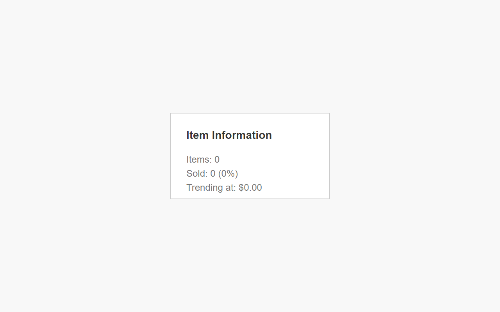

# Item Information for eBay™

Get sales data and price trends of completed listings

## Supported sites

Australia, Canada, Ireland, Malaysia, Singapore, United Kingdom, United States

## How to use it

1. Search item on a supported site.
2. Filter results to completed or sold listings. The module will now appear
below the filters.
3. Filter results as much as possible to improve accuracy.

## What it shows

- Items: Total listings, excluding international sellers and results matching
fewer words.
- Sold: Total sold items followed by a percentage, or success rate, rounded to
one decimal place.
- Trending at: A median price of sold items, excluding shipping, rounded to two
decimal places. It will be two minus signs if currencies are different or not
supported.

## Tips

- Searches with many listings will be more accurate.
- Success rate and trending price can help decide which buying format is best.
- Exclude unrelated listings, such as lots, by searching words used in titles
with a minus sign before them to improve accuracy. Add them to end or results
will be more.

## Screenshot

